# 100 days of coding

### Day 1

Refreshed concept of GitHub and
Wrote a Blog about [How to use GitHub](https://avadhut.hashnode.dev/setting-up-github) on Hashnode.

### Day 2

Refreshed concept of HTML and
Wrote a blog about [HTML Crash Course](https://avadhut.hashnode.dev/html-crash-course) on Hashnode

Created Basic structure for website using HTML

### Day 3

Refreshed concept of CSS & Flexbox and
Wrote a blog about [CSS Crash Course](https://avadhut.hashnode.dev/css-crash-course) & [Flexbox](https://avadhut.hashnode.dev/flexbox) on Hashnode

Applied CSS to website.

### Day4

Made a website using HTML & CSS.

learned how to use flexbox properties

learned about Relative length units

### Day5

learned how to use scss

created menu using javascript

### Day6

learned some Javascript functions

Create To-Do List website

### Day7

Created Library website

### Day8

Wrote a blog about [How to deploy a website using netlify](https://avadhut.hashnode.dev/netlify) on Hashnode.

Made website responsive.

[Live Link](https://library-website01.netlify.app/)

### Day9

Wrote a blog about [Javascript](https://avadhut.hashnode.dev/javascript-notes) on Hashnode.

### Day10

Wrote a blog about [Javascript](https://avadhut.hashnode.dev/javascript-notes-2) on Hashnode.

### Day11

Solved 14 Beginner problems of JavaScript.

### Day12

Solved 12 Medium problems of JavaScript.

### Day13

Solved 3 Advanced level problems of JavaScript.

### Day14

Created Basic structure for Portfolio website using HTML

### Day15

Started to learn React

- learned about Reusable Components & Props

[Notes](https://avadhut.hashnode.dev/react-crash-course)

### Day 16

Learned about :

- Event Handlers

- React Hooks

- Routing

- API Integration

[Notes](https://avadhut.hashnode.dev/react-crash-course)

### Day 17

Learned about :

- Lifecycle Hooks

- Packaging and PropTypes

### Day18

Created Alarm Clock website

### Day19

Created Notes app website

### Day20

Created Weather app website

### Day21

Created Calculator app website

### Day22

Created Password generator website

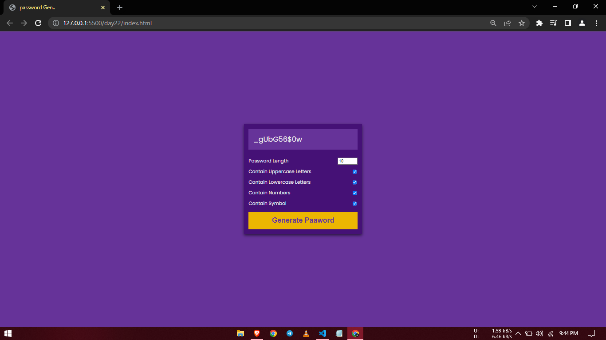

### Day23

Created Image color picker website

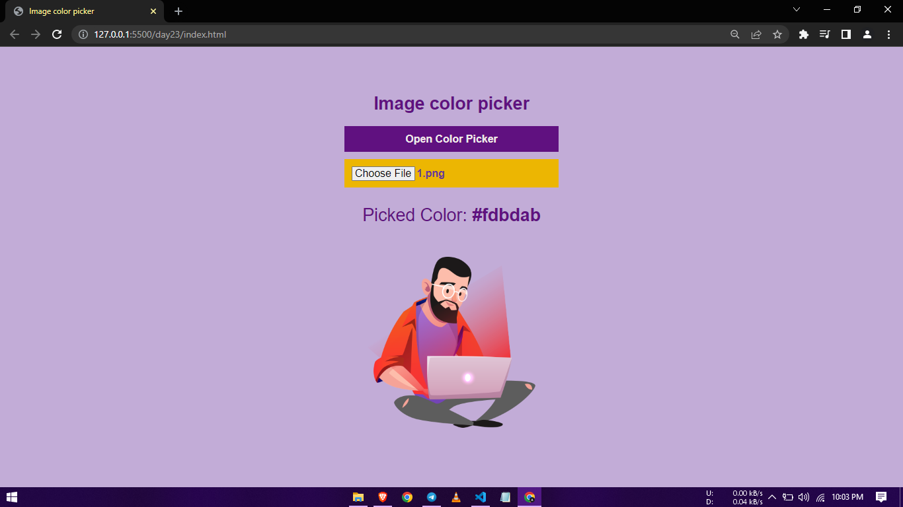

### Day24

Created Simple interest Calculator website

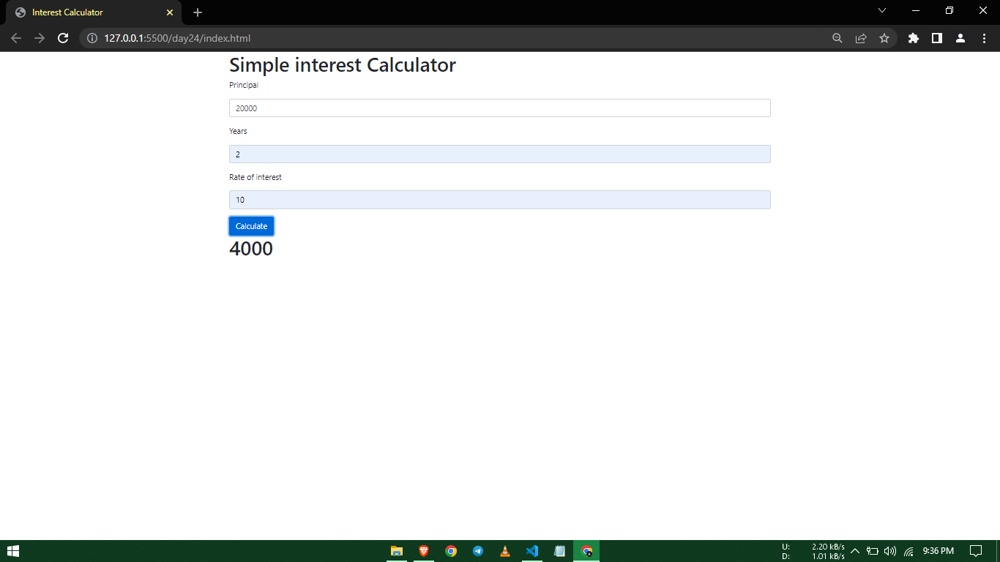

### Day25

Created To-do App using ReactJs.

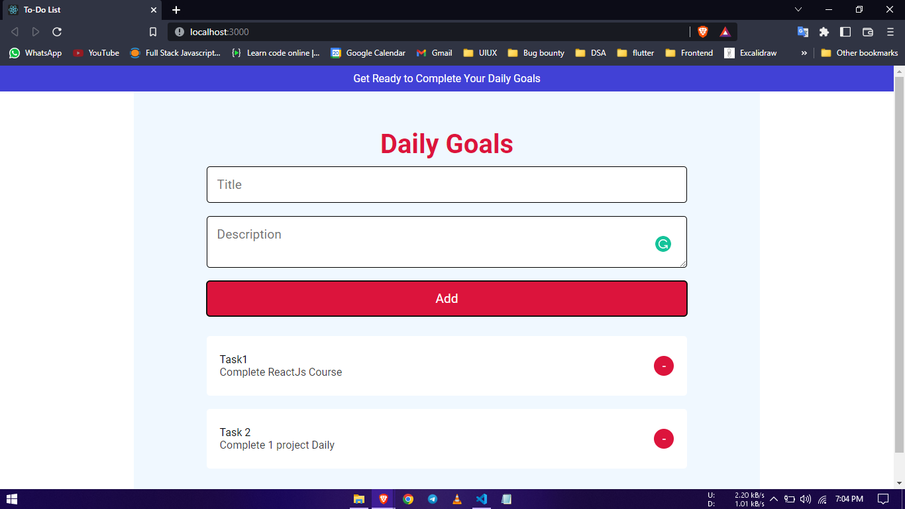

### Day26

Created Copy in Clipboard website

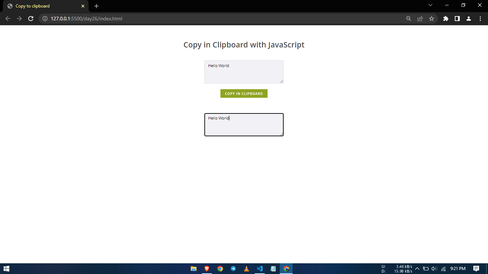

### Day27

Created Analog Clock website

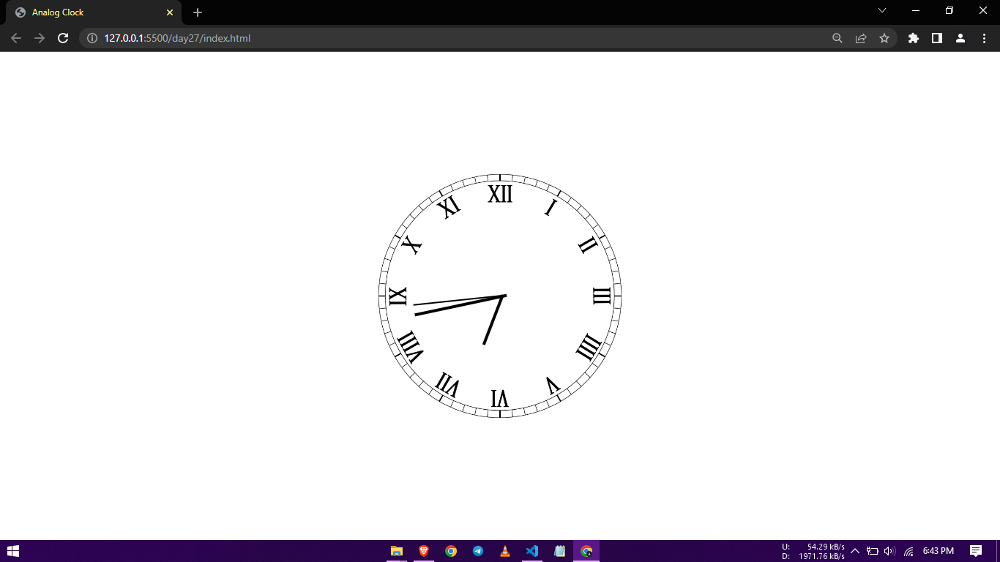

### Day28

Created File Upload with Progress Bar

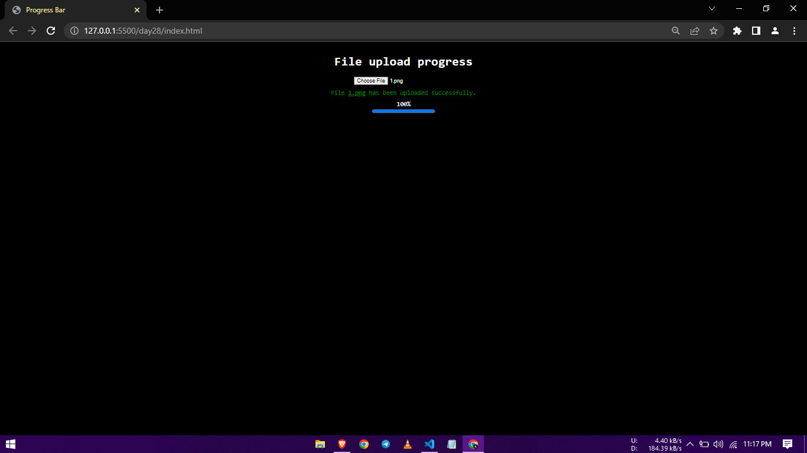

### Day29

Created OTP field

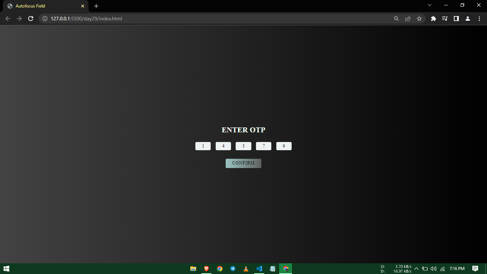

### Day30

Created Price Range Slider

### Day31

Created Simple Countdown Timer

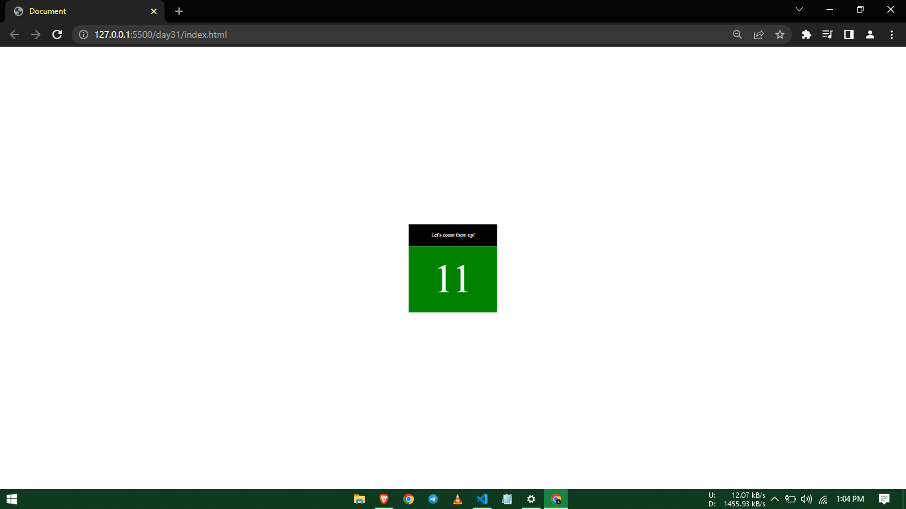

### Day32

Created Add to cart Button

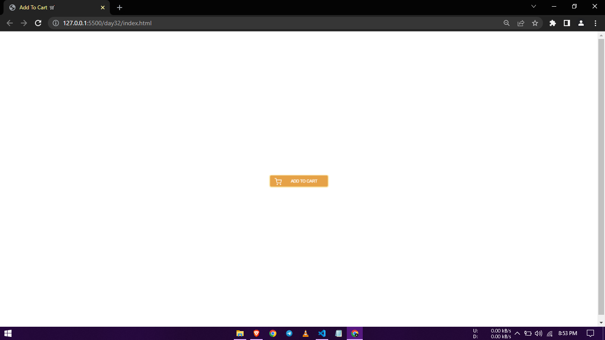

### Day33

Created Search Bar

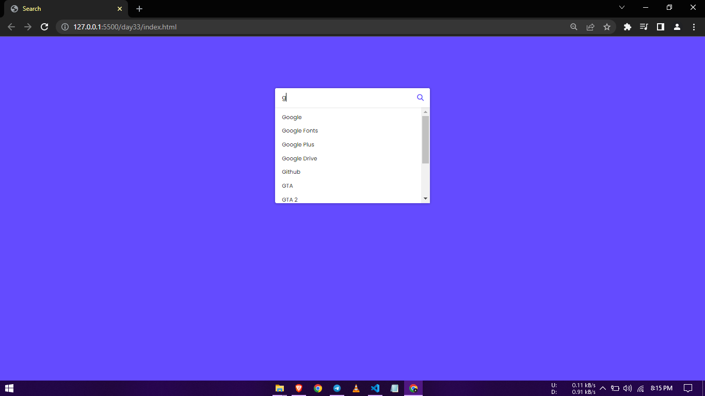

### Day34

Created Spin Wheel

